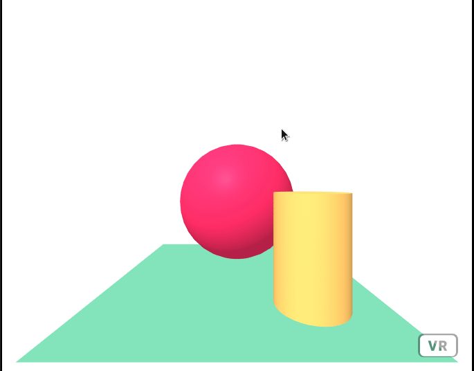

# Seek Target

Seek Target is an A-Frame component that will make one entity constantly move towards another.

## Installation

Include the component file in the head of your HTML document:

```html
<script type="text/javascript" src="seek-target.js"></script>
```

## Usage

```html
<a-box 
  seek-target="
    target: a-camera;
    distanceDelta: 0.025;
    updateDelta: 20;
  "
</a-box>
```

Attach the `seek-target` component to any entity, and pass in the relevant parameters. 

## Parameters

| Parameter          | Default  | Description |
|--------------------|--------- |-------------|
| **target**         | none     | The thing your entity should seek|
| **distanceDelta**  | 0.025    | The amount that your entity should move each update|
| **updateDelta**    | 20       | The time (in milliseconds) between each update to the seekers position|

## Example



## Contributing
Pull requests are welcome. For major changes, please open an issue first to discuss what you would like to change.


## License
[MIT](https://choosealicense.com/licenses/mit/)
